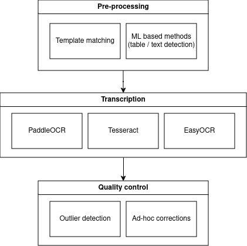

# MeteoSaver v1.0

Here we undertake data transcription of millions of daily precipitation and temperature records 
collected within the Congo Basin.




## Directory structure

Below is the structure for this project.

```
├── README.md                            <- This includes general information on the project
|                                           and introduction of project structure and modules
├── LICENSE
|
├── data
│   ├── 10_sample_different_images       <- Sample images of climate data sheets from the INERA
|                                           Yangambi archives, DRC.
|
├── models                               <- Trained and serialized models, model predictions, or model summaries. 
|
├── notebook                             <- Jupyter notebook for exploration of the code only,
|                                           as well examples of outputs from the jupyter notebooks
|                                           such as Ms Excel with OCR results and clipped images.
│
├── src                                  <- Trancribing code/scripts for use in this project.
│   ├── main.py                          <- Script to run all the different modules (scripts) below
|   |                                       i.e. in order (1) image preprocessing module, (2) table
|   |                                       detection model, and (3) transcription model
│   │
│   ├── image_preprocessing.py           <- Script to carry out preprocessing of the original scans
|   |                                       of climate data records
│   │
│   ├── table_detection_model.py         <- Script to detect the table cells from the already
|   |                                       pre-processed images
│   │
│   ├── transcription_model.py           <- Script to detect the text within the detected cells using
|   |                                       an Optical Character Recognition (OCR) or Handwritten Text
|   |                                       Recognition (HTR) model of your choice.               
│   │
│   └── output                           <- Folder with outputs from the transcription
│
├── trials                               <- On-going trials/adaptations to the code.            
│   └── handwritten_recognition.py       <- On-going trails for better recognition of handwritten text
│
├── environment.yml                      <- The requirements file for reproducing the analysis environment
|                                           Generated with `conda env export > environment.yml`
├── setup.py                             <- Make this project pip installable with `pip install -e`
|
└── Dockerfile                           <- Docker install routine for a virtual environment

```

## Setup

Two ways of creating reproducible environments are provided, the general Conda environment and an isolated Docker environment based on a Conda base image.

> [!WARNING]
> It is adviced to work in isolated Docker environments in order to ensure reproducibility, future online deployments, but first and foremost security of your computer system. Pip and to a lesser degree Conda and their python environments are a known malware vector. Although the framework we present vets the loaded library we can not assure the safety of all dependencies created downstream. The use of the local non-containerized setup is therefore not recommended.

### Conda

To create an environment which is consistent use the environment file after installing Miniconda.

```bash
conda env create -f environment.yml
```

Activate the working environment using:

```bash
conda activate transcribing_drc_data_environment
```

### Docker

The dockerfile included provides a Conda environment ([see here for docker install instructions](https://docs.docker.com/engine/install/)).
You can build this docker image using the below command. This will download all required
python components and packages, while safeguarding (sandboxing) your system
from `pip` based [security issues](https://www.bleepingcomputer.com/news/security/pypi-suspends-new-user-registration-to-block-malware-campaign/). Once build locally no further downloads 
will be required.

```
# In the main project directory run
docker build -f Dockerfile -t transcribing_drc_data_environment .
```

To spin up a docker image using:

```
docker run -it -v /local_data:/docker_data_dir transcribing_drc_data_environment
```

## Pre-processing template matching

### Data sorting

Most historical tabulated data has a fixed format. This is a feature which I'll leverage later on. However, to ensure that the below procedures work well it is necessary to identify all the different table formats in a dataset. Particular care should be taken to ensure that small differences are accounted for, as even font changes can lead to less desirable post-processing results.

Overall make sure to:

- check for font differences
- check for line spacing differences
- overall correspondence between different tables should be high

In the Jungle Weather project we identified 20+ format of which three make up the bulk of all scanned data (>60%).

It is best to sort the images using a non-destructive method. It is therefore best to use a non-destructive photo editor or manager combined with tags rather to sort the data, rather than copying the source files around. In case of the Jungle Weather we used the [Shotwell photo editor and manager](https://wiki.gnome.org/Apps/Shotwell), on Windows and OSX Adobe Lightroom might serve the same purpose.

### Template generation

Once all different table formats are identified empty `templates` should be generated, and matching table cells annotated.

#### Creating an empty template

Where possible search the dataset for an already empty table. If no empty table exist use a table with as few data points as possible. Open this (almost) empty table using an image processing software. I suggest using [GIMP](https://www.gimp.org/), as I'll use a plugin later on to outline the cells of a table and it is freely available cross platforms.

Convert the this open file to a black and white template, while using the [levels](https://docs.gimp.org/2.10/en/gimp-tool-levels.html) and [curves]() to boost contrast and remove any unwanted gradients in the image. Remove all text which is not part of an empty template using the [eraser](https://docs.gimp.org/2.10/en/gimp-tool-eraser.html). The final result should look as the image below.


When saving these templates use a comprehensive naming scheme with a prefix and a number separated with an underscore (_) such as: "format_1.jpg" corresponding to the folder containing the image data.

```
This formatting is important for successful use of the python processing code!
```

#### Outlining table cells

To specify the location of data within a table we will use the guides in GIMP, and a plugin to save this information. To save the guides in GIMP first install the ["save & load guides plugin"](https://github.com/khufkens/GIMP_save_load_guides). After installation of the plugin (and restarting GIMP) outline all cells in a table using GIMP guides. Below you see a template with all columns outlined with vertical guides.


Once done, save the guides using the plugin (use: Image > Guides > Save). Make sure that the name used for the guides **exactly** matches the name of the image on which the guides are based. The guides will be saved in a file called "guides.txt" and stored this location:  "[userfolder]/.gimp-2.8/guides/guides.txt". Copy this file to your project folder for future processing (I store template data in a dedicated template folder containing all template images and the guides.txt file).

Note that you can save multiple sets of guides for multiple templates in the same guides.txt file.

## Post processing - Quality Assessement and Quality Control (QA/QC) checks:


## Authors
Derrick Muheki

Koen Hufkens

Bas Vercruysse

Krishna Kumar Thirukokaranam Chandrasekar

Wim Thiery


## Acknowledgements

This template was inspired by the [python_proj_template](https://github.com/pepaaran/python_proj_template).
